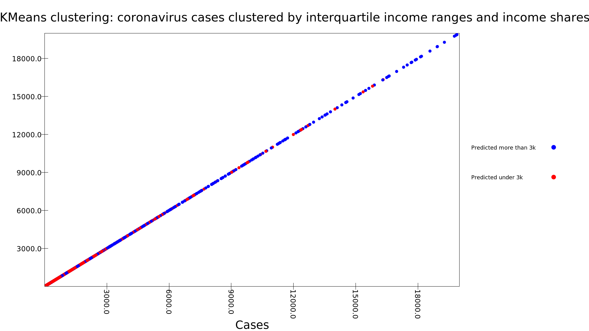
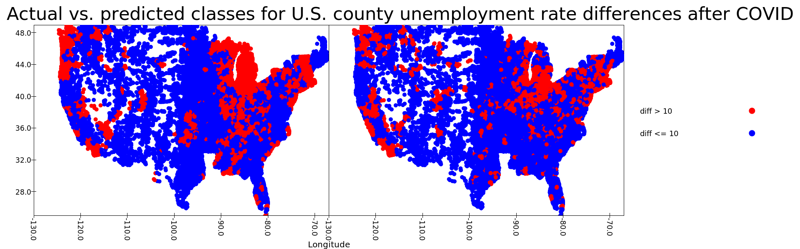
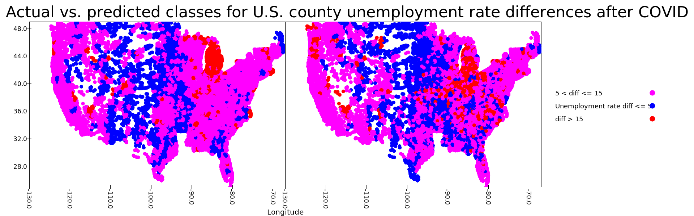

# COVID-19 and Inequality: Predicting the Effects of the Pandemic Based on Indicators of Disparity

## Motivation

This project is one I've been wanting to do for a while. The core of it is a dataset released by Raj Chetty and the Harvard
Opportunity Insights center that contains indicators for upward mobility and inequality at the county level, among other things.
I read the paper "Where is the land of Opportunity? The Geography of Intergenerational Mobility in the United States" a long time ago,
and it's stuck with me ever since. Several of the facts brought to light in that paper reveal systemic flaws in our country. 
A person growing up in Southern California has far more chance to succeed in life than someone growing up in Atlanta, and
that is shocking in a nation that it supposed to be centered on opportunity to gain wealth. 

With this project, I wanted to explore whether or not communities affected by inequality and lack of upward mobility
have been significantly affected by the COVID-19 pandemic. The pandemic is interesting because there are multiple 
facets to its impact: unemployment, infection rates, and a misinformation epidemic have all been rolled into one.
The goal of this project was just to see what those effects looked like specifically for communities with higher levels
of inequity, and to see if I could get a classifier or clustering algorithm to find some interesting results on that topic. 
I also wanted to examine other factors, like urban sprawl, that have been studied in relation to inequity and found to be
well correlated. I wasn't really expecting to get incredible results; I've generally found that data about serious, real
world issues with thousands of potential variables influencing it is hard for an undergrad to analyze. I think I've made
some decent findings, though.

## Datasets

I used numerous datasets over the course of this analysis. I will try to give a brief description of each one:

1. New York Times: Mask use Data. This one is simple. It contains county level data representing responses to a poll
   that asked respondents how frequently they wore a mask when they expected to be within six feet of others in public.
   Those polled could respond with never, rarely, sometimes, frequently, or always.
2. New York Times: COVID infection and death counts: Another fairly simple one. By county deaths and infections, daily, from
   March of this year (2020) until October.
3. Opportunity Insights: Outcome data. This one is a bit more complicated. It contains indicators calculated from anonymized IRS 
   tax records, tracking children of low income households through their lives to see where they end up. One of these
   is an indicator that predicts where a person who grew up in a county's bottom 25% income percentile will end up later in life.
   It also has files that contain data for indicators like incarceration rates, Gini coefficients, and many other indicators
   of poverty and inequality.
4. Urban sprawl index. This one didn't get used much, but it's still interesting. It contains an index that measures, well,
   urban sprawl, as well as other stats about the levels and types of urbanization present in a county, like population density.
5. BLS labor stats. This is a dataset I pulled in for how useful it would be for analyzing economic effects of the virus.
   County level unemployment rates, etc.
6. Helper files: I used a dataset provided in class to get longitude and latitude for U.S. counties, and I used
   a file that maps state names to abbreviations to make joining certain datasets together easier.
   
All in all, my data folder was 2.9GB at the end of this project. I'm honestly a little surprised I never had a hang or crash
while doing processing.

## Questions

The main questions I tried to answer in analyzing this dataset were these:

1. How well do inequity and lack of upward mobility predict cases and deaths? 
2. How well do the above predict unemployment rate during the first wave of the pandemic.

I picked these questions because they seemed the easiest for the data to answer. I knew I could probably get a solid
amount of ML work and visualizations out of both of them, and they're both very interesting questions whose answers have
interesting implications. In other words, I mostly picked them because they're questions that I really would like answered.

## My process

For my first question, I started off looking at incarceration rates, which correlated with both cases and deaths at around 0.06.
I expected a pretty weak correlation there, so I continued to look at variables, the next being mean household income rank
for people who grew up in the 25th percentile. That didn't pan out very well either, so I moved on and looked at 
10+ correlation matrices before I arrived at two indicators of inequity as my best candidates. The first was the
Interquartile Income Range, which measures the difference between the 75th percentile and 25th percentile family income
within a commuter zone. I also found examining the share of parents with incomes between the 25th and 75th percentile to be helpful here.
I tried clustering the dataset based on those two factors. I wanted to see if I could come up with clusterings that aligned
with a certain threshold of cases in a county. This didn't go super well. My first attempts were thrown off by outliers 
with extremely high values for each of those variables. Almost all of those outliers had very high case counts.
To compensate for this, I tried clustering a smaller subset of the data, with only case counts of at most 20000 at the latest
recorded date. For 2 clusters, this yielded a somewhat clustering that aligned fairly well with counties having three thousand or more cases.

This accurately clustered 83% of the dataset, however, I'm not really convinced that this is significant. This clustering
really isn't telling us much about the data. It can't be extended to more than 2 clusters without losing a lot of accuracy, and
just telling us whether or not a county will have more than 3 thousand cases is very vague. As such, although it's accurate, I don't
really view it as being all that useful. Since this is also the best clustering I found, **I think I can go ahead and answer my first question
with a no, or at least a _probably not_**.

My second questions went a bit better. I started off with the same file from Opportunity Insights that I used to 
make the clustering. I computed the difference in unemployment between April of 2020, the month that unemployment spiked to 15%,
and March of 2020. I found that this correlated well with a number of the variables from the Opportunity files, and decided
I would try to classify counties by how severe the spike in unemployment was for them in April. To do this, I used four 
parameters for classification: The first was Absolute Upward Mobility, which predicts the change in income percentile that a child growing
up in the 25th income percentile of the nation will experience as an adult in a county; The second was Interquartile Income Range; 
The third was the value of the 25th income percentile of adults in a county who themselves grew up in the nation's 25th income percentile;
Finally, the fourth was the median income of parents in a county.

I began with a gradient boosted tree classifier, and sought to classify the data into counties which experienced a spike in 
unemployment rate above 10%, and those who experience a spike of less than 10%. Using the four factors I mentioned, 
and some fairly trivial weighting, my classifier acheived an accuracy of 83%. 

In both this plot and the next, actual classes are depicted on the left, and predicted classes on the right.

I was encouraged, and moved to a three class problem, where the first class was counties experiencing a spike below 5%,
the second a spike between 5 and 15%, and the third a spike above 15%. Frankly, I was amazed at how well this worked with
some basic weighting. I achieved an 80% accuracy with a random forest classifier, visualized below. The most important features in both classifiers
were Interquartile Income Range and Absolute Upward Mobility.

Though this model worked poorly for four classes and above, I find it very promising, both because it replicates classes decently well,
and because it seems to replicate most geographic trends reasonably well. It's also worth noting that the classes in the three class
problem can tell us something. Since the nationwide unemployment spike was just over 10%, the three class classifier is predicting
whether or not a county will have been affected less, more, or on par with the national average. **This is an encouraging result,
and the fact that its classification is entirely based on indicators of inequity leads me to answer my second questions with a resounding
_yes_**.

A big part of my process in general was loading in different data files to see what kind of correlation they had with variables I wanted to analyze. I had to have looked at 10+ correlation matrices for this project. What I mention above is mostly just what led to my most interesting results that answer my questions. A ton of other analysis went into exploring the data and looking for correlations that might be suitable for learning.  
